# FreeRTOS的入门与进阶

## 快速上手

### 移植FreeRTOS内核

#### 软件平台（可以直接使用软件模拟仿真，后文会说到）

**Keil5 v5.36 [点击下载](https://img.anfulai.cn/bbs/96992/MDK536.EXE)  使用默认Compiler5**

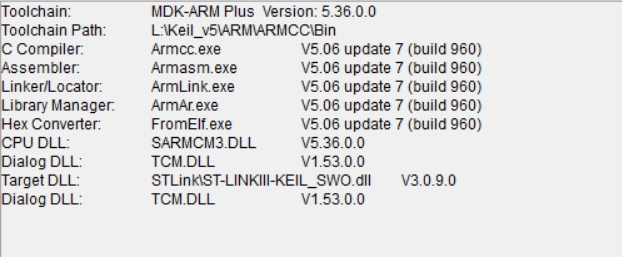

#### 版本选择说明

**首先先下载内核源代码，[点击下载](https://sourceforge.net/projects/freertos/files/FreeRTOS/V9.0.0/FreeRTOSv9.0.0.zip/download)我使用的是V9.0.0，因为这个版本最稳定，更新的版本是亚马逊收购FreeRTOS后添加了其他一些功能特性，以及支持云连接，虽有收费（例如AWS集成，安全功能，图形界面开发工具，商业支持，以及高级的扩展库），但许多基础功能仍然是免费的，社区版的FreeRTOS仍然可以使用**

#### 开始移植

**前提，最好能够熟练的使用Keil5创建工程**

**当你下载好内核源码后，打开FreeRTOS\Source文件夹，你将会看到**

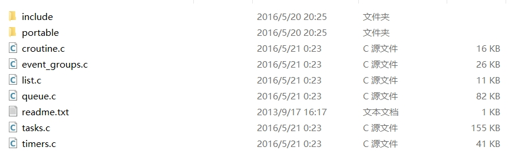

**你现在可以看到的6个.c文件，就是FreeRTOS主要的内核程序文件，主要的内容分别为协程，事件组，链表，队列，任务，定时器，目前只需要知道这些即可，使用这个内核，只需要遵守一些规则就可以在这个操作系统上的编程了，移植的时候这些.c文件建议都复制到你的工程文件的FreeRTOS\Source中**

**include文件显然就是.c文件对应的.h文件，以及其他的一些必要.h文件，移植的时候，需要将这个文件整个复制到你的工程文件夹（FreeRTOS\Include）下，然后将其添加到头文件的搜索路径中**

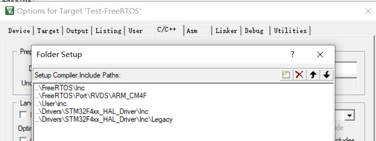

**portable文件里是装的是与硬件兼容的文件，以及内存管理的文件，我在测试FreeRTOS时，使用的板载芯片是STM32F407ighx，其为ARM Cortex-M4架构，所以我只需要复制portable\MenMang下的.c文件（一般使用heap_4.c）和portable\RVDS\ARM_CM4F到你的工程文件夹下**

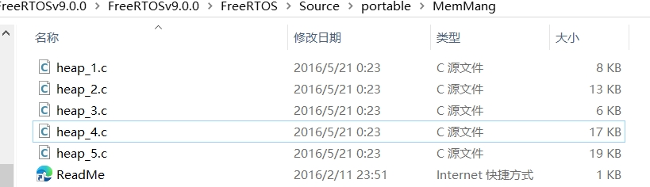

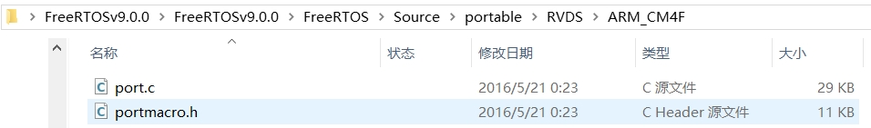

**你可以看到在portable\RVDS\ARM_CM4F下也有头文件，所以在添加头文件路径时，不要忘记这个文件**

**于是，在你的工程文件夹中，将会得到**

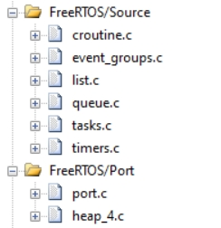

最后添加上主函数和启动文件，驱动文件

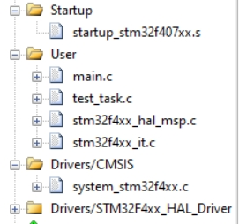

**对于FreeRTOS，其实你还需要一个配置文件，才能够使用它，即FreeRTOSConfig.h，这个文件你可以在刚下载的内核文件的Demon例程里找到，然后复制到你的工程include里面，当然也可以复制我移植好的Test-FreeRTOS里的FreeRTOSConfig.h**

**哦对，为了避免不必要的”报错“ 你最好打开这个“No Warning”和 “C99 Mode”**

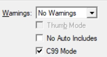

**至此，就移植完成了！**

#### 上手使用

**创建你的第一个任务！**

**我的源码里使用的是STM32F407ighx，你可以使用Keil5的软件仿真运行，不必下载到芯片，如下图，选择 Use Simulator**

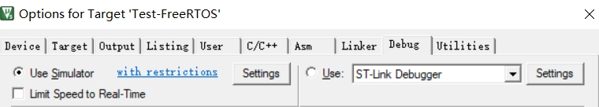

**说明：FreeRTOS中，创建任务一般有两种方式，一个是在main函数里一个任务一个任务的创建，最后开启FreeRTOS的调度器，于是FreeRTOS就开始运行**

 **还有一种方法是只在main函数里创建一个任务，然后在这个任务里创建所有你需要的任务，等你把所有需要的任务都创建完成后，删除这个创建任务的       任务，最后开启调度器，FreeRTOS开始运行**

**前置知识：什么是任务？在FreeRTOS中，任务是一个无返回值，无限循环执行的函数，你在创建一个任务之前，需要先定义这个任务的句柄，例如**

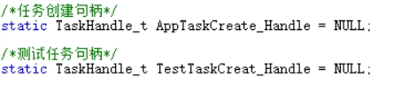

**在FreeRTOS中，操控任务，都是通过其句柄控制，然后你要定义好任务的入口函数，例如**

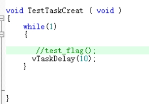

**你可以看到，“无限循环”“没有返回值”，其实还有一个必需成分，即阻塞延时vTaskDelay()，后面再讲为什么需要阻塞**

**然后就可以调用任务创建函数了，例如**

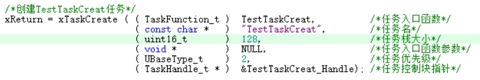

**你可以看到，创建一个任务，还需要指定其任务名，任务栈大小，任务入口函数参数，任务优先级**

**其中，任务名一般设为入口函数同名即可，一般不使用任务名，在FreeRTOS中，任务优先级数值越大，即优先级越大**

**其中，任务可以设置的最大优先级和总任务栈大小，都可以且需要在FreeRTOSConfig.h中配置**

**你现在已经创建好一个任务了，可以试着编译运行一下，如果没有报错就说明应该没有问题，有报错也不用着急，80-90%的问题，都可以在浏览器搜到案例，如果系统成功在运行了，你可以进仿真单步运行，看看系统到底在干什么**

**你会发现，系统好像一直在一个循环里反复执行，如图**

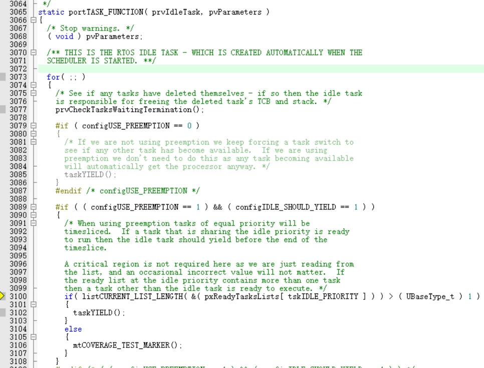

**猜猜系统在做什么？系统是怎么实现所谓的实时运行的？**

**你应该知道，系统有一个东西，叫频率，也就是系统的心跳，其快慢也是在FreeRTOSConfig.h中指定，具体数值，但是一般和芯片的系统时钟初始化时指定的频率不同**

**如图为16MHZ**

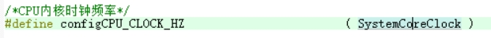

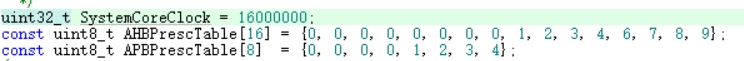

**这个是CPU的时钟频率**

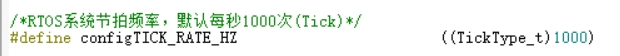

**上图才是RTOS的频率，RTOS的频率越快，CPU的压力就越大，如图你可以看到，现在RTOS的频率为1000HZ，其实可以理解为一个定时器的频率为1000HZ，也就是说每1ms就有一个tick来临（tick为系统节拍单位），每一个tick来临的时候，FreeRTOS会干什么呢？会触发这个定时器的中断处理程序**

**在这个中断处理程序里，FreeRTOS会维护它的定时器，处理任务的阻塞延时，调用调度器检查是否有更高优先级的任务处于就绪状态，如果有，则需要进行任务切换，则系统会执行PendSV_Handler实现任务的切换，此时你就可以明白任务为什么一定要有阻塞延时，因为如果没有阻塞延时，那这个任务大概率会永远处于就绪状态，也就是说，优先级小于这个任务的任务，将永远不会被执行，但是，空闲任务的钩子函数不需要阻塞量，因为空闲任务是系统自动生成的优先级最低的任务，用来保证系统每时每刻都有任务在运行！那你明白了所谓的实时操作系统实时在哪里吗？关键就在这个阻塞延时，每个任务都会主动让出CPU使用权一段时间，独乐乐不如众乐乐！然而仅靠大家依次主动让出CPU其实还是不够，FreeRTOS还支持抢占式调度，也就是说，当一个任务正在运行呢，结果有一个优先级比他还高的大哥醒过来了，这个时候他的大哥就可以直接把CPU占了，这样就可以更好的响应实时需求，所以对于一些对时间要求比较高的任务，优先级应该设置高点，那么问题又来了，任务运行到一半竟然可以被打断，那当这个任务可以再次接管CPU时，它还能接上次的运行吗，还是只能重头再来呢？这个问题留给读者朋友，我可以提醒一下，可以看看PandSVHandler究竟在干什么**

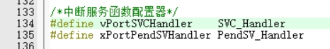

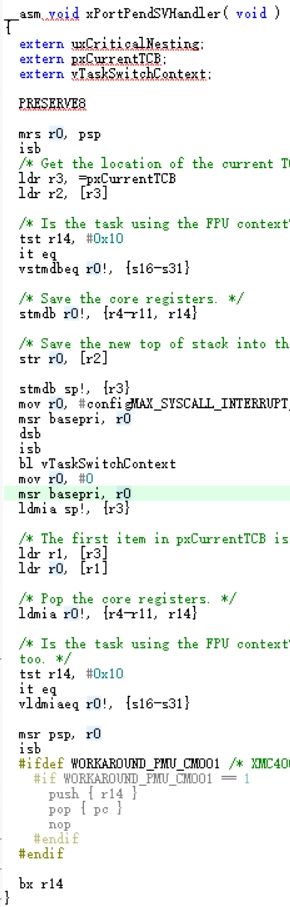

**读图后，读者可能要问，那么什么是SVC_Handler呢？FreeRTOS内核中，对SVC_Handler函数进行了重定义实现**


**SVC_Handler其实是叫系统调用的中断，什么时候会调用它呢？本质上讲，在需要更改内核对象的数据的时候，比如改变任务优先级，处理信号量的时候，就需要触发这个中断，那么这个中断究竟干了什么呢？实际上SVC_Handler是在保存当前的任务执行的CPU栈环境，然后进行中断处理，比如修改某某任务的优先级，然后恢复之前的CPU栈环境，也就是继续执行当前任务，所以其实，SVC_Handler其实是ARM提供的一个优先级非常高的中断回调函数，它可以直接改变CPU运行的栈环境，所以SVC_Handler也叫特权模式**

**那么当前任务是什么呢，虽然我们已经创建好一个任务了，但貌似没有指定当前任务**

**其实已经指定了，不过是在调度器中自动指定的，调度器会选择最高优先级的任务为当前任务运行**

**到这里，你可以在脑袋里想象FreeRTOS运行的时候，究竟在干什么吗**

**首先呢，你把程序编译下载进芯片ROM，芯片首先开始执行启动文件，进行复位处理，硬件初始化，堆栈初始化，中断向量表初始化，然后进入main函数，在main函数里，进行库函数的初始化系统时钟的初始化，然后创建RTOS任务，然后开始调度，调度器会选择优先级最高的任务为当前任务，保存当前环境的上下文，加载任务的上下文，更新任务状态，事实上每一个tick来临时，都会触发调度器进行更新定时器，处理任务阻塞延时等但是不能把调度器理解为tick定时器的回调函数**

## FreeRTOS的内核对象

* **任务**
* **信号量**
* **队列**
* **软件定时器**
* **互斥量**
* **事件组**
* **消息缓冲区**
* **流缓冲区**
* **任务通知**

## 内核对象简介

* **任务（Task）**

**任务是 FreeRTOS 中的基本执行单元，功能的实现就是在任务里执行，任务具有自己的上下文、优先级和栈空间。任务可以并发执行**

* **信号量（Semaphore）**

**用于任务之间的同步和互斥。信号量分为二进制信号量和计数信号量，以及特殊的互斥量，可以控制对共享资源的访问**

* **消息队列（Queue）**

**允许多个任务之间传递数据，可以在任务间安全地发送和接收数据**

* **软件定时器（Software Timer）**

**用于设置定时事件，通过定时器可以在特定时间调用回调函数，适合处理需要定时执行的任务**

* **事件组（Event Group）**

**用于任务间的事件同步，支持多个事件标志的组合和等待，适合复杂的状态管理**

* **消息缓冲区（Message Buffer）**

**适用于发送和接收变长消息，可以在任务之间高效地传递数据**

* **流缓冲区（Stream Buffer）**

**用于处理流数据，支持对数据流的快速读写操作，适合数据流应用场景**

* **任务通知（Task Notification）**

**为每个任务提供一个简单的通知机制，允许任务快速相互通信和同步**

* **协程（Croutine）**

**以更低的开销实现并发执行的任务，要求轻量级**

## 内核对象实现

**函数实现和对应的中断版本函数的实现，就不再这个readme中展开写了（篇幅太长），有的函数还有对应的静态内存分配版本，我也没有在这个readme中写出，而是默认以动态内存分配的函数版本为例，给出函数名，你可以根据函数名，在我的测试的源文件中搜到函数体的实现**

### 任务（Task）

* **任务创建**

```
//总的来说，任务创建函数就是在为任务分配指定的内存空间，然后初始化，添加进就绪列表（调度队列）
BaseType_t xTaskCreate(TaskFunction_t pxTaskCode,                // 任务入口函数指针
                        const char * const pcName,              // 任务名称，用于调试
                        const uint16_t usStackDepth,           // 任务栈的深度
                        void * const pvParameters,              // 传递给任务的参数
                        UBaseType_t uxPriority,                // 任务优先级
                        TaskHandle_t * const pxCreatedTask)    // 输出参数，接收创建的任务句柄


```

* **任务删除**

```
//总的来说，任务删除函数就是将指定任务从就绪列表，事件列表删除，释放内存
void vTaskDelete(TaskHandle_t xTaskToDelete)              //删除指定的任务

```

* **任务阻塞**

```
//总的来说，任务阻塞函数就是将任务添加到阻塞列表，指定阻塞时长
//只保证阻塞时长，但不保证什么时候恢复就绪态，用于防止CPU过快的只执行同一段代码
void vTaskDelay(const TickType_t xTicksToDelay)             // 函数定义，阻塞当前任务指定的 Tick 数
//确保任务在固定的时间周期里循环执行
void vTaskDelayUntil( TickType_t * const pxPreviousWakeTime, const TickType_t xTimeIncrement )
```

* **任务通知**

```
//发送通知给任务，一般使用xTaskNotifyGive()
#define xTaskNotifyGive( xTaskToNotify ) xTaskGenericNotify( ( xTaskToNotify ), ( 0 ), eIncrement, NULL )
//总的来说，通知发送函数就是在设置对应任务的通知值，然后将其从等待列表移除，加入就绪列表，最后检测是否需要切换任务BaseType_t xTaskGenericNotify(TaskHandle_t xTaskToNotify,        // 函数定义，通知指定的任务
                               uint32_t ulValue,                 // 通知的值
                               eNotifyAction eAction,            // 通知动作类型
                               uint32_t *pulPreviousNotificationValue) // 用于存放之前通知值的指针

//在中断中使用的通知发送函数为xTaskGenericNotifyFromISR()，如果它检测到接收到通知的任务优先级比当前任务高，只会标记有必要切换，因为在ISR（中断服务）中不适合立即上下文切换，等ISR结束后再处理

//任务接收通知函数
BaseType_t xTaskNotifyWait( uint32_t ulBitsToClearOnEntry, uint32_t ulBitsToClearOnExit, uint32_t *pulNotificationValue, TickType_t xTicksToWait )
//两者一般成对使用
```

* **任务优先级管理**

  ```

  //任务优先级更改函数
  //总的来说，任务优先级更改函数就是在根据新优先级切换任务，更新任务自身优先级，以及对应事件列表，就绪列表的优先级记录值
  void vTaskPrioritySet( TaskHandle_t xTask, UBaseType_t uxNewPriority )

  //获取指定任务的当前优先级
  UBaseType_t uxTaskPriorityGet( TaskHandle_t xTask )

  //获取指定任务的当前优先级（ISR内使用）
  UBaseType_t uxTaskPriorityGetFromISR(TaskHandle_t xTask)

  //恢复挂起的任务，就是将目标任务从挂起列表中删除，然后添加进就绪列表
  void vTaskResume( TaskHandle_t xTaskToResume )

  //ISR中使用的挂起任务恢复函数，核心不同的是，在ISR中检测到需要切换任务时，不会马上切换，而是做需要切换的标记
  BaseType_t xTaskResumeFromISR( TaskHandle_t xTaskToResume )

  //任务挂起函数
  void vTaskSuspend( TaskHandle_t xTaskToSuspend )
  ```
* **任务状态查询**

```
//任务状态查询函数，通过查询任务所在的列表来判断任务的状态
eTaskState eTaskGetState( TaskHandle_t xTask )

//获取任务栈的高水位标记，根据任务栈的起始位置，调用内部函数计算栈的高水位标记
UBaseType_t uxTaskGetStackHighWaterMark( TaskHandle_t xTask )

//获取当前系统中任务的数量
UBaseType_t uxTaskGetNumberOfTasks( void )

//获取指定任务当前优先级
UBaseType_t uxTaskPriorityGet( TaskHandle_t xTask )

```

* **任务堆栈使用情况**

```
//获取任务栈的高水位标记，根据任务栈的起始位置，调用内部函数计算栈的高水位标记，//前文已经写过不再复述
//前提：使用了动态内存分配
UBaseType_t uxTaskGetStackHighWaterMark( TaskHandle_t xTask )
/*内核对象占有总堆大小设置器，不包括系统占有*/
#define configTOTAL_HEAP_SIZE                    ((size_t)24576)
```

### 信号量（Semaphore）

```
//创建二值信号量，信号量的创建其实就是创建特殊的队列，先分配内存，然后由内部函数初始化队列结构
#define xSemaphoreCreateBinary() xQueueGenericCreate( ( UBaseType_t ) 1, semSEMAPHORE_QUEUE_ITEM_LENGTH, queueQUEUE_TYPE_BINARY_SEMAPHORE )
QueueHandle_t xQueueGenericCreate( const UBaseType_t uxQueueLength, const UBaseType_t uxItemSize, const uint8_t ucQueueType )

//创建一个互斥信号量
#define xSemaphoreCreateMutex() xQueueCreateMutex( queueQUEUE_TYPE_MUTEX )
QueueHandle_t xQueueCreateMutex( const uint8_t ucQueueType )

//互斥信号量有拥有者和拥有对象，但二值信号量是看生产者和消费者

//创建一个递归互斥信号量
#define xSemaphoreCreateRecursiveMutex() xQueueCreateMutex( queueQUEUE_TYPE_RECURSIVE_MUTEX )

//获取递归互斥信号量（多次获取）
#define xSemaphoreTakeRecursive( xMutex, xBlockTime )	xQueueTakeMutexRecursive( ( xMutex ), ( xBlockTime ) )
BaseType_t xQueueTakeMutexRecursive( QueueHandle_t xMutex, TickType_t xTicksToWait )
//释放递归互斥信号量（多次释放）
#define xSemaphoreGiveRecursive( xMutex )	xQueueGiveMutexRecursive( ( xMutex ) )
BaseType_t xQueueGiveMutexRecursive( QueueHandle_t pxMutex )

//计数信号量在创建的时候要指定其最大计数值，在该计数信号量的生存周期里不能更改最大计数值，除非先删除然后重新创建一个
//调用信号量递增函数xSemaphoreGive()对刚刚定义的计数信号量进行递增
uxSemaphoreGetCount()可以查看计数值
//获取信号量
#define xSemaphoreTake( xSemaphore, xBlockTime )  xQueueGenericReceive( ( QueueHandle_t ) ( xSemaphore ), NULL, ( xBlockTime ), pdFALSE )
BaseType_t xQueueGenericReceive( QueueHandle_t xQueue, void * const pvBuffer, TickType_t xTicksToWait, const BaseType_t xJustPeeking )
//ISR中使用的获取信号量
#define xSemaphoreGiveFromISR( xSemaphore, pxHigherPriorityTaskWoken )	xQueueGiveFromISR( ( QueueHandle_t ) ( xSemaphore ), ( pxHigherPriorityTaskWoken ) )
BaseType_t xQueueReceiveFromISR( QueueHandle_t xQueue, void * const pvBuffer, BaseType_t * const pxHigherPriorityTaskWoken )


//释放信号量，将其返回到可用列表
#define xSemaphoreGive( xSemaphore )	xQueueGenericSend( ( QueueHandle_t ) ( xSemaphore ), NULL, semGIVE_BLOCK_TIME, queueSEND_TO_BACK )
//总的来说，先是检查队列信息，比如看看还有没有空余空间，如果有，就复制数据到队列等，还有处理超时情况
BaseType_t xQueueGenericSend( QueueHandle_t xQueue, const void * const pvItemToQueue, TickType_t xTicksToWait, const BaseType_t xCopyPosition )
//ISR中使用的释放信号量函数
#define xSemaphoreGiveFromISR( xSemaphore, pxHigherPriorityTaskWoken )	xQueueGiveFromISR( ( QueueHandle_t ) ( xSemaphore ), ( pxHigherPriorityTaskWoken ) )
BaseType_t xQueueGiveFromISR( QueueHandle_t xQueue, BaseType_t * const pxHigherPriorityTaskWoken )


//递归的获取一个信号量（用于递归调用）
#define xSemaphoreTakeRecursive( xMutex, xBlockTime )	xQueueTakeMutexRecursive( ( xMutex ), ( xBlockTime ) )
BaseType_t xQueueTakeMutexRecursive( QueueHandle_t xMutex, TickType_t xTicksToWait )
//递归地释放一个信号量
#define xSemaphoreGiveRecursive( xMutex )	xQueueGiveMutexRecursive( ( xMutex ) )
BaseType_t xQueueGiveMutexRecursive( QueueHandle_t xMutex )

//获取当前信号量地可用数量（仅用于计数信号量）
#define uxSemaphoreGetCount( xSemaphore ) uxQueueMessagesWaiting( ( QueueHandle_t ) ( xSemaphore ) )
UBaseType_t uxQueueMessagesWaiting( const QueueHandle_t xQueue )

//其实不管是二值信号量还是递归互斥量，还是计数信号量，本质的类型都是一样的，都是信号量，不同的是要调用对应的函数进行初始化处理和使用！
```

### 消息队列（Queue）

```
//创建一个消息队列，在信号量中已经写过
#define xQueueCreate( uxQueueLength, uxItemSize ) xQueueGenericCreate( ( uxQueueLength ), ( uxItemSize ), ( queueQUEUE_TYPE_BASE ) )
//将一个数据项发送到队列中，在信号量中已经写过
#define xQueueSend( xQueue, pvItemToQueue, xTicksToWait ) xQueueGenericSend( ( xQueue ), ( pvItemToQueue ), ( xTicksToWait ), queueSEND_TO_BACK )
#define xQueueSendFromISR( xQueue, pvItemToQueue, pxHigherPriorityTaskWoken ) xQueueGenericSendFromISR( ( xQueue ), ( pvItemToQueue ), ( pxHigherPriorityTaskWoken ), queueSEND_TO_BACK )
//从队列中接收一个数据项，在信号量中已经写过
#define xQueueReceive( xQueue, pvBuffer, xTicksToWait ) xQueueGenericReceive( ( xQueue ), ( pvBuffer ), ( xTicksToWait ), pdFALSE )
BaseType_t xQueueReceiveFromISR( QueueHandle_t xQueue, void * const pvBuffer, BaseType_t * const pxHigherPriorityTaskWoken )
//将数据项发送到队列地尾部，实际的实现函数也在信号量中写过
#define xQueueSendToBack( xQueue, pvItemToQueue, xTicksToWait ) xQueueGenericSend( ( xQueue ), ( pvItemToQueue ), ( xTicksToWait ), queueSEND_TO_BACK )
#define xQueueSendToBackFromISR( xQueue, pvItemToQueue, pxHigherPriorityTaskWoken ) xQueueGenericSendFromISR( ( xQueue ), ( pvItemToQueue ), ( pxHigherPriorityTaskWoken ), queueSEND_TO_BACK )
//将数据项发送到队列地头部，实际的实现函数在信号量中写过
#define xQueueSendToFront( xQueue, pvItemToQueue, xTicksToWait ) xQueueGenericSend( ( xQueue ), ( pvItemToQueue ), ( xTicksToWait ), queueSEND_TO_FRONT )
#define xQueueSendToFrontFromISR( xQueue, pvItemToQueue, pxHigherPriorityTaskWoken ) xQueueGenericSendFromISR( ( xQueue ), ( pvItemToQueue ), ( pxHigherPriorityTaskWoken ), queueSEND_TO_FRONT )
//查看队列头部地数据项，但不将其从队列删除
#define xQueuePeek( xQueue, pvBuffer, xTicksToWait ) xQueueGenericReceive( ( xQueue ), ( pvBuffer ), ( xTicksToWait ), pdTRUE )
BaseType_t xQueuePeekFromISR( QueueHandle_t xQueue,  void * const pvBuffer )
//查询队列中当前有多少个消息项，信号量中也指出过
UBaseType_t uxQueueMessagesWaiting( const QueueHandle_t xQueue )
UBaseType_t uxQueueMessagesWaitingFromISR( const QueueHandle_t xQueue )
//删除指定的消息队列并释放相关内存
void vQueueDelete( QueueHandle_t xQueue )
```

### 软件定时器（Software Timer）

```
//创建一个软件定时器，并返回定时器的句柄
TimerHandle_t xTimerCreate(	const char * const pcTimerName,
								const TickType_t xTimerPeriodInTicks,
								const UBaseType_t uxAutoReload,
								void * const pvTimerID,
								TimerCallbackFunction_t pxCallbackFunction )
//启动或重新启动一个软件定时器
#define xTimerStart( xTimer, xTicksToWait ) xTimerGenericCommand( ( xTimer ), tmrCOMMAND_START, ( xTaskGetTickCount() ), NULL, ( xTicksToWait ) )
BaseType_t xTimerGenericCommand( TimerHandle_t xTimer, const BaseType_t xCommandID, const TickType_t xOptionalValue, BaseType_t * const pxHigherPriorityTaskWoken, const TickType_t xTicksToWait )

//停止一个正在运行的软件定时器
#define xTimerStop( xTimer, xTicksToWait ) xTimerGenericCommand( ( xTimer ), tmrCOMMAND_STOP, 0U, NULL, ( xTicksToWait ) )
//改变一个软件定时器的周期
 #define xTimerChangePeriod( xTimer, xNewPeriod, xTicksToWait ) xTimerGenericCommand( ( xTimer ), tmrCOMMAND_CHANGE_PERIOD, ( xNewPeriod ), NULL, ( xTicksToWait ) )
//删除一个软件定时器，释放相关资源
#define xTimerDelete( xTimer, xTicksToWait ) xTimerGenericCommand( ( xTimer ), tmrCOMMAND_DELETE, 0U, NULL, ( xTicksToWait ) )
//检查一个软件定时器是否处于活动状态
BaseType_t xTimerIsTimerActive( TimerHandle_t xTimer )
//定时器延迟调用函数（不能在中断中使用），可以在定时器的回调函数中，用下面函数将另外的函数添加进需要执行的队列，当任务调度器再次运行时，系统将会处理这些这个排队函数，实际上，下面这个函数可以在任何FreeRTOS任务上下文中使用，不局限于定时器回调函数
BaseType_t xTimerPendFunctionCall( PendedFunction_t xFunctionToPend, void *pvParameter1, uint32_t ulParameter2, TickType_t xTicksToWait )
```

### 事件组（Event Group）

```
//事件组具有强大灵活的多任务管理和同步的功能，事件组可以面对多个任务
//创建一个事件组，并返回事件组的句柄
EventGroupHandle_t xEventGroupCreate( void )
//设置事件组的一个或多个事件标志位
EventBits_t xEventGroupSetBits( EventGroupHandle_t xEventGroup, const EventBits_t uxBitsToSet )
//清除事件组的一个或多个事件标志位
EventBits_t xEventGroupClearBits( EventGroupHandle_t xEventGroup, const EventBits_t uxBitsToClear )
//等待一个或多个事件标志位被设置，可以选择阻塞或非阻塞等待
EventBits_t xEventGroupWaitBits( EventGroupHandle_t xEventGroup, const EventBits_t uxBitsToWaitFor, const BaseType_t xClearOnExit, const BaseType_t xWaitForAllBits, TickType_t xTicksToWait )
//获取当前事件组中事件标志位的状态
#define xEventGroupGetBits( xEventGroup ) xEventGroupClearBits( xEventGroup, 0 )
//删除一个事件组，释放相关资源
void vEventGroupDelete( EventGroupHandle_t xEventGroup )
```

### 消息缓冲区（Message Buffer）（FreeRTOSv10.2.0及以上才支持）

```
//由于我用的是FreeRTOSV9.0.0，其不支持消息缓冲区，下面的函数名仅供参考，可能与实际函数名有出入
//创建一个消息缓冲区，并返回其句柄
xMessageBufferCreate()
//将数据发送到消息缓冲区
xMessageBufferSend()
//从消息缓冲区接收数据
xMessageBufferReceive()
//从中断服务例程（ISR）向消息缓冲区发送数据
xMessageBufferSendFromISR()
//从中断服务例程（ISR）接收数据
xMessageBufferReceiveFromISR()
//检查消息缓冲区是否已满
xMessageBufferIsFull()
//检查消息缓冲区是否为空
xMessageBufferIsEmpty()
//删除消息缓冲区，并释放相关资源
xMessageBufferDelete()
```

### 流缓冲区（Stream Buffer）（FreeRTOSv10.2.0及以上才支持）

```
//创建一个流缓冲区，并返回其句柄
xStreamBufferCreate()
//将数据发送到流缓冲区
xStreamBufferSend()
//从流缓冲区接收数据
xStreamBufferReceive()
//从中断服务例程（ISR）向流缓冲区发送数据
xStreamBufferSendFromISR()
//从中断服务例程（ISR）接收数据
xStreamBufferReceiveFromISR()
//检查流缓冲区是否已满
xStreamBufferIsFull()
//检查流缓冲区是否为空
xStreamBufferIsEmpty()
//删除流缓冲区，并释放相关资源
vStreamBufferDelete()
```

### 任务通知（Task Notification）

```
//任务通知相比于事件组，更加轻量直接，针对单个任务发送通知
//任务通知也是生产者和消费者的思维方式，你会发现，凡是一对一的通知与接收的关系，就是生产者和消费者的关系
//给指定任务发送一个通知，通知的值可以是UNIQUE的（唯一标识符）或可以是数值
#define xTaskNotify( xTaskToNotify, ulValue, eAction ) xTaskGenericNotify( ( xTaskToNotify ), ( ulValue ), ( eAction ), NULL )
BaseType_t xTaskGenericNotify(TaskHandle_t xTaskToNotify,        // 函数定义，通知指定的任务
                               uint32_t ulValue,                 // 通知的值
                               eNotifyAction eAction,            // 通知动作类型
                               uint32_t *pulPreviousNotificationValue) // 用于存放之前通知值的指针

//将当前任务的通知值加1（适合用于给正在运行的任务发送通知）
#define xTaskNotifyGive( xTaskToNotify ) xTaskGenericNotify( ( xTaskToNotify ), ( 0 ), eIncrement, NULL )

//以阻塞或非阻塞的方式等待接收任务通知，并返回通知的值
uint32_t ulTaskNotifyTake( BaseType_t xClearCountOnExit, TickType_t xTicksToWait )
//等待通知信号，直到接收到通知或超时
BaseType_t xTaskNotifyWait( uint32_t ulBitsToClearOnEntry, uint32_t ulBitsToClearOnExit, uint32_t *pulNotificationValue, TickType_t xTicksToWait )
//清除任务的通知状态
BaseType_t xTaskNotifyStateClear( TaskHandle_t xTask )
//从中断服务例程（ISR）中给任务发送通知
#define xTaskNotifyFromISR( xTaskToNotify, ulValue, eAction, pxHigherPriorityTaskWoken ) xTaskGenericNotifyFromISR( ( xTaskToNotify ), ( ulValue ), ( eAction ), NULL, ( pxHigherPriorityTaskWoken ) )
BaseType_t xTaskGenericNotifyFromISR( TaskHandle_t xTaskToNotify, uint32_t ulValue, eNotifyAction eAction, uint32_t *pulPreviousNotificationValue, BaseType_t *pxHigherPriorityTaskWoken )
//给指定任务发送通知，同时查询当前通知值
#define xTaskNotifyAndQuery( xTaskToNotify, ulValue, eAction, pulPreviousNotifyValue ) xTaskGenericNotify( ( xTaskToNotify ), ( ulValue ), ( eAction ), ( pulPreviousNotifyValue ) )
```

### 协程

```
//所有协程在FreeRTOS中享有相同的优先级，因此协程的调度取决于编写的逻辑而非优先级，实际上协程本身不支持优先级，但是可以编写不同优先级的不同协程！，看了源码就能理解了，协程也可以使用消息队列，但是，可以创建任务来控制协程的执行，协程适合于状态机，轻量级的并发处理场景，而任务更适合复杂管理和优先级应用
//任务之间的通信方式，比如信号量，事件组，消息队列，任务通知，也可以和协程进行同步，通知操作!
//创建协程
BaseType_t xCoRoutineCreate( crCOROUTINE_CODE pxCoRoutineCode, UBaseType_t uxPriority, UBaseType_t uxIndex )
//启动和调度协程(在空闲任务的钩子函数里)
void vCoRoutineSchedule( void )
```

## 内核对象实验

**请看测试代码源代码，源代码里有更详细的讲解说明和实例，精华都在源代码里(-!_!-)**

### 源码文件结构

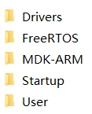

* **Drivers：处理器驱动（实际上是硬件时钟初始化）和 STM32f4芯片的hal库驱动STM32F4xx_HAL_Driver（可选，测试并没有使用）**
* **FreeRTOS：其中放的就是FreeRTOS的内核源码和与硬件的接口文件，以及内存管理方面的源文件**
* **MDK-ARM：Keil5生成的工程文件在这里面，源文件的编译中间件和最终的hex文件在其中Object文件里**
* **Startup：处理器的启动文件**
* **User：用户的源文件，包括主文件（main.c）和测试源文件**

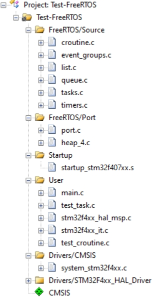

* **Keil里面的文件树，mian.c里进行相关初始化和内核对象的创建，test_task.c绝大部分的测试内容在这里面，test_croutine.c里专门放的是协程相关的测试函数**

## 其他优秀教程资源

* **FreeRTOS 官方指南 [点击了解](https://www.freertos.org/zh-cn-cmn-s/Documentation/01-FreeRTOS-quick-start/01-Beginners-guide/00-Overview)**
* **野火FreeRTOS实战开发 [点击了解](https://doc.embedfire.com/rtos/freertos/zh/latest/index.html)**
* **B站的正点原子教程 [点击了解](https://www.bilibili.com/video/BV12D4y1m7co/?vd_source=6d4eefced39d7dd4ba690dcb763ec969)**

# The END

**使用FreeRTOS内核API很容易，但还有更值得追求的，那就是FreeRTOS的队列，任务等数据结构的管理思想和实现方式，还有为了维护系统的稳定性的编码措施（完整性检查）和提高代码效率的编码风格！**

**要想有真正的理解，光死读代码肯定不够，还是得想办法多用，现实总会出现一些意想不到得问题，但并非无法解决**

**Good Luck To You !**

作者：wow

邮箱：1522019841@qq.com
